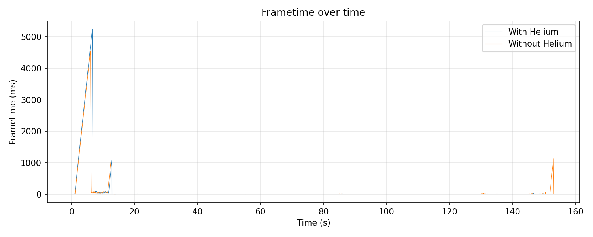
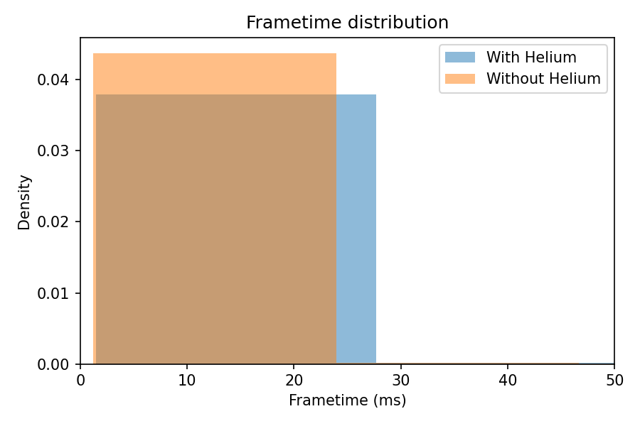

# Benchmark comparison

Level: 133260800 — Orbit Auto Deco
Settings: 144 FPS lock, Frame Extrapolation On (MegaHack), ~167/255 mods active, No V-Sync On

## System

- OS: Microsoft Windows 11 Pro Build 26200
- CPU: AMD Ryzen 5 3600
- GPU: NVIDIA GeForce RTX 2080 SUPER (driver 610.47)
- RAM: 32GB (2x16GB) 3200MT/s
- Presentation mode: Fullscreen Exclusive

## With Helium

- Samples: 19601
- Duration: 152.851 s
- Avg FPS: 128.24
- Avg frametime: 7.798 ms
- Median frametime (p50): 7.031 ms
- 99th percentile (p99): 14.946 ms
- Min frametime: 1.488 ms
- Max frametime: 5245.84 ms

## Without Helium

- Samples: 19647
- Duration: 153.619 s
- Avg FPS: 127.89
- Avg frametime: 7.819 ms
- Median frametime (p50): 6.995 ms
- 99th percentile (p99): 16.296 ms
- Min frametime: 1.229 ms
- Max frametime: 4545.899 ms

## Summary

- Avg FPS: With Helium 128.24 vs Without Helium 127.89 (Δ +0.35)
- Avg frametime: With Helium 7.798 ms vs Without Helium 7.819 ms (Δ -0.021 ms)

## Plots

